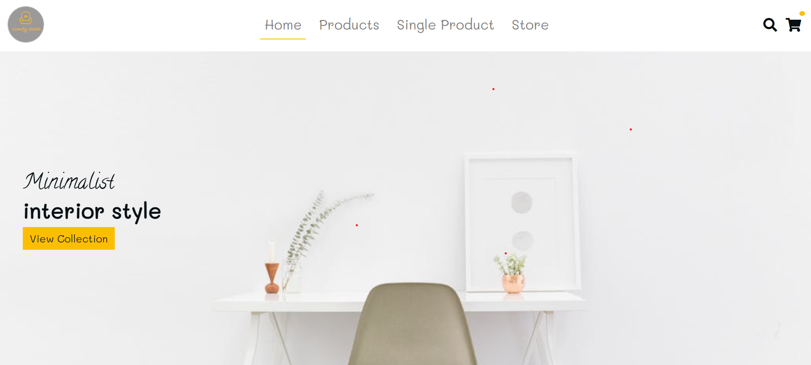
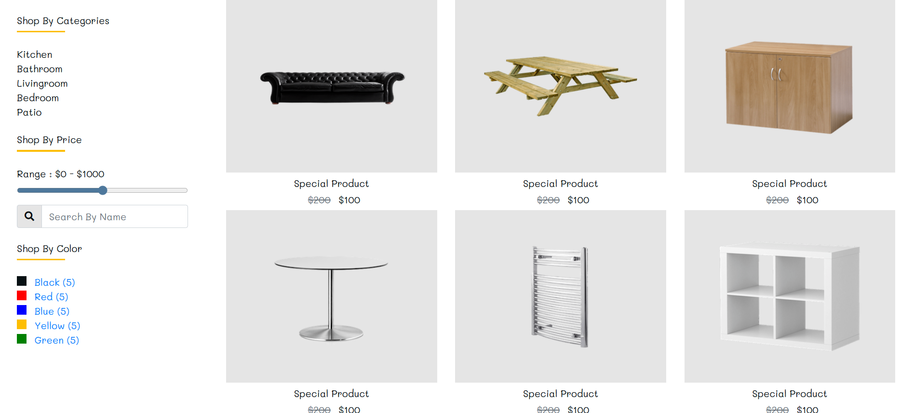
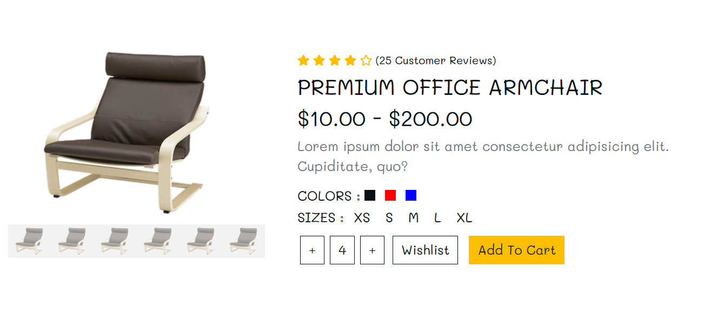
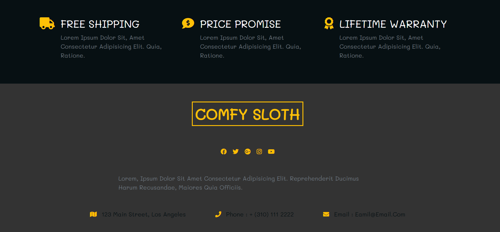
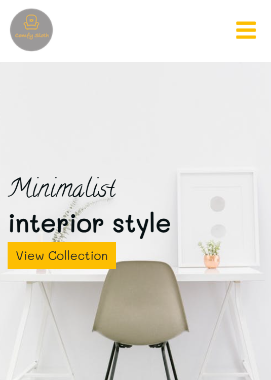

# Furniture Store Website 🛋️

**Furniture Store** is a simple, responsive web project that showcases a modern furniture e-commerce layout built with **HTML**, **CSS**, and **JavaScript**.  
It includes pages for browsing products, viewing product details, and a styled user interface for a furniture shop.

🔗 **Live Demo:** https://ammaraladl.github.io/Furniture-Store/

---

## 📌 Features

- 🏠 **Home Page:** Clean landing layout with featured products and promo sections.
- 🛍️ **Product Listing:** Browse multiple furniture categories.
- 📦 **Product Details:** Preview individual product information.
- 🌐 Fully built with **HTML, CSS, and vanilla JavaScript**.
- 🎨 Modern, minimalist design suitable for portfolio or practice.

---

## 📁 Project Preview

---

## 🛠 Technologies Used

This project uses:

- **HTML5**
- **CSS3**
- **JavaScript**

No frameworks or external libraries — perfect for showcasing fundamental web skills.

